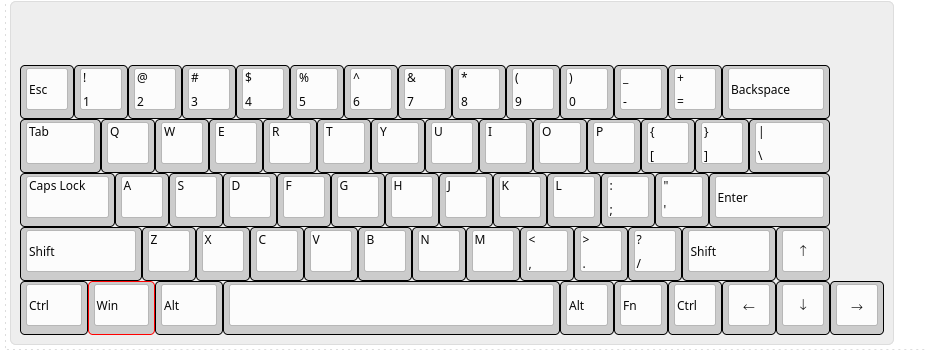
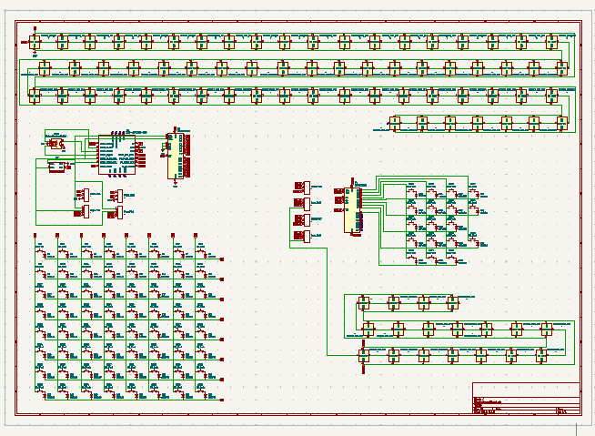
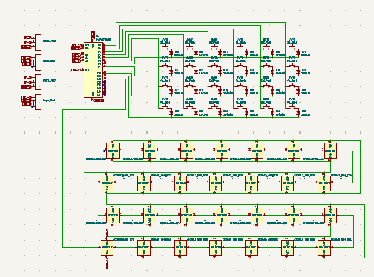

**Total Time Spent: 40 Hours**

> but take it with a pinch of salt, I didn't keep track of time properly, I probably spent way more then that researching, designing, debugging, repeating, and redoing everything. So this is just the minimum time I think I spent on this project.

# Day 1: Research - July 22nd

**Time Spent: [3-4] hours**

So I want a minimal keyboard but I also love using numpad and more keys or inputs. On this day I watched this video which inspired me to make it.

**Inspiration Video:** [DIY Modular Macropad](https://www.youtube.com/watch?v=7DfexfHzT-w&list=LL&index=6&t=8s)

He made a modular macropad and used the I2C protocol to communicate with the modules. I thought it was a good idea and I will use the same protocol to communicate with my modules.
This guy made a mistake by using a common interrupt key throughout all the modules but I will use different interrupt keys for modules {future me here, that didn't happen because I ran out of GPIOs.🥲}

Now it's time to decide which modules I will have for my keyboard. I have decided that I want to have somewhat a 60% keyboard layout on the main keyboard and have the modules attachable on both sides. So I went for this layout for the main keyboard.

And for numpad I will have 18 keys as follows:
It has an extra key than the standard numpad layout because I don't want a big ass 0 key.

Okay so I know how to make a wired keyboard, I just made a [Wired hackpad](https://github.com/hashim-cpro/hackpad) but how do I make a wireless keyboard. Let's Google it or Gemini it actually.

Okay so it seems like this nice nano board is quite popular for making wireless keyboards but there is a problem.
It works on 3.3V power and logic which would not be enough to run or control our RGB and peripherals. Also it is big, I want a minimal keyboard.
But maybe there are work arounds for that so let's just go for it since it has a good community support and was built for this specific purpose but for god's sake all the sellers that sell it have very high shipping rates for me. I have to keep things in budget, I found the alternatives for this board on AliExpress but they were a bit sus so I went with Seeed XIAO nRF52840, it has less GPIO pins but we can work around that with I2C expanders but it is really small which is good.

# Day 2: Schematics - July 23rd

**Time Spent: [5] hours**

Okay so let's make the schematics for the main keyboard.

{This was not the first version, this is the final one, I made a lot of changes to the schematics because I did it wrong a couple of times and had to redo it that's why it took me so long + i kept making changes as i was learning and finding new components that I wanted to use.}

# Day 3: PCB Design - July 24th

**Time Spent: [5] hours**

Okay I made the whole PCB of the main keyboard in KiCad but then a sudden realization occurred to me after watching someone on YouTube soldering hotswappable sockets on the PCB. I was like wait a minute, I can do that too. So I went back to the PCB and changed the footprints of the switches to hotswappable sockets. But then almost all of my routing which literally took me hours to do was gone. I was like noooooo, so I had to route the whole PCB again.

Here was the before PCB without sockets:

Then I was like fuck this shit.

# Day 4: PCB Routing Continued + firmware - July 28th-29th-30th, 2024

**Time Spent: [10-15] hours**

Probably gotta re-route the whole thing so add the numpad in the schematic. I hadn't addded the numpad before

After that I routed the whole PCB again. I also learned that it is okay if you don't follow the schematic wiring layout strictly as the PCB editor is right to tell you to share common tracks. I DIDN"T KNEW THAT, I thought it may short circuit or something but then after some hours I realised how dumb i was to do this, this made routing so hard for me previously because i used to just verify each route from the schematic. But anyways I caught up and re routed the whole thing

There were some errors with the footprint library I was using for my LEDs, solved them and then modified the board outline and was all done with PCB:

**Time Spent: [6-7] hours**

For firmware I wanted to make both QMK and ZMK but QMK doesn't support my board and I came to know that when I wrote the whole thing, god dang it.

Then I went for ZMK, I knew that ZMK was based on Zephyr so i automatically assumed that it would have support for all my peripherals, turns out it didn't for one main component which is our I2C expander, there were no drivers for it in ZMK but there are in Zephyr, ZMK uses 3.5 and support for them were added in 3.6 Zephyr which means we don't have to redo the whole thing again (god knows how many times I just got frustrated and wanted to give up) KiCad was not cooperating with me, it was crashing all the time, I had to restart it like 10 times in a day. But anyway I hope for the best and I will try to make the firmware work with ZMK, if not then I will hack together a driver for the I2C expander. I tried to in the current version but I am not sure if it will work. But anyways wait a little bit and then we will have ZMK support built in for the I2C expander. Probably that would be before even my parts arrive. So no worries. Anyways firmware is kinda boring, we can debug it once we have the parts and the PCB in hand. And if all that didn't work (which is almost impossible) then we can always use the Arduino framework to make it work. I can't test it because I don't have the parts yet but I am sure it will work out + QMK firmware for RP2040 might work out of the box, I will try that too. (I am skeptical about it though because only a random user on Reddit claims to have it working)
> Edit: I just realized that my PCB is MCU agnostic, well kind of, I can use and MCU from XIAO series so I can choose rp2040 or nRF52840, it is upto you (highway reviewer) should I get rp2040 and just use QMK or get nRF52840 and use ZMK, and hope that until the parts arrive, ZMK would have shifted to Zephyr 3.6 and have support for the I2C expander, if not then I will hack together a driver for it.
# Day 5: Case Design - July 31th, 2024

**Time Spent: [5-7] hours**

Now for the case, I made it in Shapr3D, it was kind of a rush job because I had to make it in a day, so I made it in a day, it was not that hard, I just made the case for the main keyboard and the numpad, I might want to change the battery from Li-ion to Li-Po because it is more compact and has more capacity, but I will see about that later.

Now the case building progress:

I wanted a minimal case but before making the case I tried to export the PCB to Shapr3D but for some reason the export was like a logic bomb from KiCad, it crashed Shapr3D every time, I had to try multiple formats and then finally STL worked. This was the most frustration that I got in this project, I had to make the case from scratch like 3 times because of this. Now time to add the remaining peripherals on PCB like most importantly the magnetic pogo pins because they had to be aligned and supported well, I couldn't find a 3D model for my specific pogo pins that I was using so I had to make it myself, it was not that hard.

Now all of my peripherals were in place and I was ready to make the case, I made the case in Shapr3D, it was not that hard, I just had to make sure that all the peripherals were in place and aligned properly.

I am still not sure about the case, I may change it later, but for now it is good enough for submission.

FYI I am working on it at the moment and will update the readme once I am done with it.

I placed the MCU in the bottom using these pins, IDK what to call them.

Now you might be wondering why the battery and charging module are not connected anywhere in the PCB or the MCU, it's because of a weird positioning of the battery pads in the MCU. I am new to soldering so I thought just use those pins to lift up the MCU a little from the board and use wire to connect the battery and charging module to the MCU. So yes it is intentional that the battery and charging module are not connected to the PCB, anywhere in the schematic and PCB.
