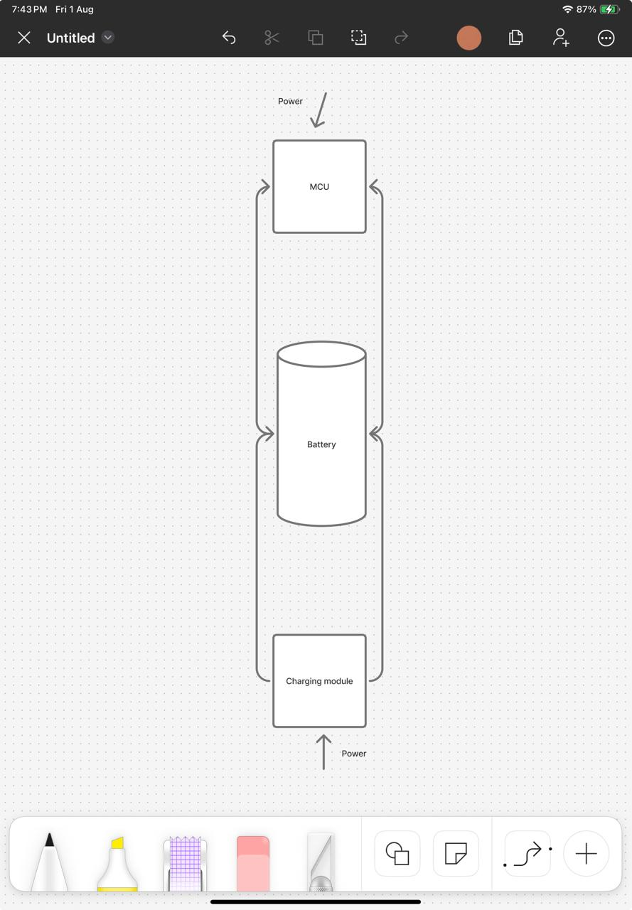

# 60% Modular Keyboard

It is a 60% wireless keyboard(bluetooth) also works wired. It has magnetic modules. Currently I only added a Numpad but almost anything could be added in a chain as long as it works on i2c.
it has hotswapable switches, rgb lights for each key, OLED, rotoary encoder, dedicated fast charging module(1000mah) and a 2000mah single cell battery. Also it is kind of MCU agnostic, you can use any XIAO series MCU with it, for example rp2040 if you don't want bluetooth or nRF52840.

# CAD Design

I used shapr3d to make the case, it is not done, I am still working on it, once I am happy with a case I will add it here, but the current case is as follows:

# Wired connections

The charging module and battery are not connected to the PCB electrically, I will use wires for them.

# PCB design

I used KiCad to make the PCB. Here are the schematics:

Here is the PCB:

# Firmware

For Firmware I made two of them, one in QMK and one in ZMK. ZMK will work only when it is upgraded to zephyr 3.6 or use a custom driver for the I2C expander. QMK will work out of the box but it is not bluetooth, it is wired only. I will add the firmware here once I am done with it.

# BOM

| Name                      | Quantity           | Price (USD) | Shipping Cost (USD) |
| ------------------------- | ------------------ | ----------- | ------------------- |
| Switches                  | 90                 | $52.85      | $0.00               |
| Keycaps                   | 1                  | $23.25      | $0.00               |
| Hotswapable sockets       | 110                | $15.39      | -                   |
| Stabilizers               | -                  | $10.77      | $0.00               |
| Custom PCB                | 5                  | $20.00      | $25.00              |
| Magnetic pogo pins        | 2x 3p and 2x 4p    | $20.28      | $0.00               |
| Microcontroller           | 1                  | $10.27      | $5.00               |
| I2C expander              | 2                  | $4.68       | $9.29               |
| Battery                   | 1                  | $7.00       | $0.00               |
| Battery protection module | 1                  | $4.00       | $0.00               |
| Charging module           | Will supply myself | $0.00       | $0.00               |
| Boost converter           | Will supply myself | $0.00       | $0.00               |

haven't added the total because I am not sure which battery to use for now + also not sure if hackclub will provide the 3d printed case or i have to add it here but a rough estimate without the case is under 220$. I will confirm the battery in it and then add the total with and without the case.
