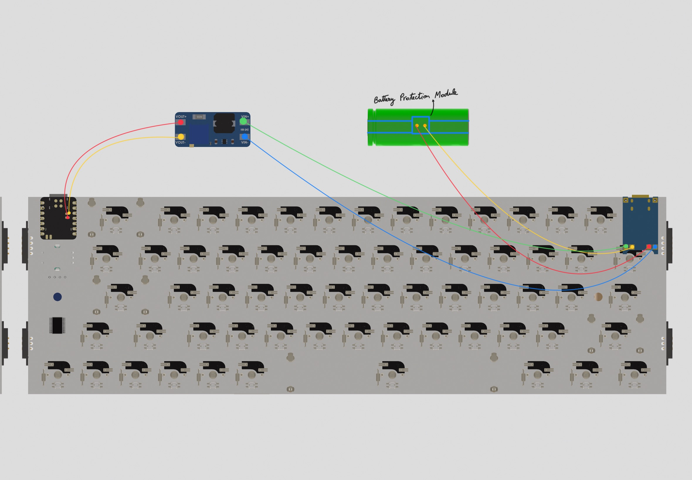
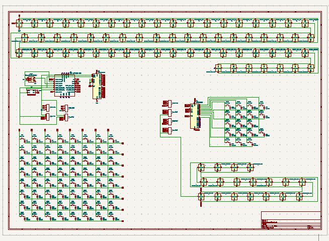

# 60% Modular Keyboard

It is a 60% wireless keyboard(bluetooth) also works wired. It has magnetic modules. Currently I only added a Numpad but almost anything could be added in a chain as long as it works on i2c.
it has hotswapable switches, rgb lights for each key, OLED, rotoary encoder, dedicated charging module(1000mah) and a 10000mah battery. Also it is kind of MCU agnostic, you can use any XIAO series MCU with it, for example rp2040 if you don't want bluetooth or nRF52840.

# CAD Design

I used shapr3d to make the case, it is not done, I am still working on it, once I am happy with a case I will add it here, but the current case is as follows:

# Wired connections

The charging module and battery are not connected to the PCB electrically, I will use wires for them.

# PCB design

I used KiCad to make the PCB. Here are the schematics:

Here is the PCB:

# Firmware

For Firmware I made two versions:

1. **QMK Firmware**: Works out of the box but it is wired only (no Bluetooth). This is ready to use.
2. **ZMK Firmware**: Supports Bluetooth wireless functionality. This will work only when ZMK is upgraded to Zephyr 3.6 or with a custom driver for the I2C expander.

Both firmware options are available in this repository under the Firmware directory.

# BOM

here's the csv: [Link](https://docs.google.com/spreadsheets/d/1DyREVeE_MUjtT9r5M6x5S8JvudkvJUOvS-f6R7vg9m8/edit?usp=sharing)
| Name | Quantity | Price (USD) | Shipping Cost (USD) | URL |
| ------------------------- | ------------------ | ----------- | ------------------- | --- |
| [Switches](https://www.aliexpress.com/item/1005008458590123.html) | 90 | $35.73 | $0.00 | [Link](https://www.aliexpress.com/item/1005008458590123.html) |
| [Keycaps](https://www.aliexpress.com/item/1005006068241056.html) | 1 | $23.25 | $0.00 | [Link](https://www.aliexpress.com/item/1005006068241056.html) |
| [Hotswapable sockets](https://www.aliexpress.com/item/1005009187521124.html) | 110 | $15.39 | $0.00 | [Link](https://www.aliexpress.com/item/1005009187521124.html) |
| [Stabilizers](https://www.aliexpress.com/item/1005001686299616.html) | 1x set | $10.77 | $0.00 | [Link](https://www.aliexpress.com/item/1005001686299616.html) |
| Custom PCB | 5 | $20.00 | $25.00 | jlcpcb |
| [Magnetic pogo pins](https://www.aliexpress.com/item/1005008564171277.html) | 2x 3p and 2x 4p | $20.28 | $0.00 | [Link](https://www.aliexpress.com/item/1005008564171277.html) |
| [Microcontroller](https://www.aliexpress.com/item/1005007416714633.html) | 1 | $10.27 | $5.00 | [Link](https://www.aliexpress.com/item/1005007416714633.html) |
| [I2C expander](https://www.aliexpress.com/item/1005008705264264.html?spm=a2g0o.productlist.main.11.68e87c79MkEB3P&algo_pvid=652b9ee5-a6ca-4eb2-a04e-750bf44d7567&algo_exp_id=652b9ee5-a6ca-4eb2-a04e-750bf44d7567-10&pdp_ext_f=%7B%22order%22%3A%22-1%22%2C%22eval%22%3A%221%22%7D&pdp_npi=6%40dis%21USD%215.04%215.04%21%21%2136.00%2136.00%21%402101246417554269745763126e6e24%2112000046323693257%21sea%21PK%212630002641%21ABX%211%210%21n_tag%3A-29910%3Bm03_new_user%3A-29895&curPageLogUid=tP3Bol6SwU30&utparam-url=scene%3Asearch%7Cquery_from%3A%7Cx_object_id%3A1005008705264264%7C_p_origin_prod%3A) | 2 | $5.04 | $3.47 | [Link](https://www.aliexpress.com/item/1005008705264264.html?spm=a2g0o.productlist.main.11.68e87c79MkEB3P&algo_pvid=652b9ee5-a6ca-4eb2-a04e-750bf44d7567&algo_exp_id=652b9ee5-a6ca-4eb2-a04e-750bf44d7567-10&pdp_ext_f=%7B%22order%22%3A%22-1%22%2C%22eval%22%3A%221%22%7D&pdp_npi=6%40dis%21USD%215.04%215.04%21%21%2136.00%2136.00%21%402101246417554269745763126e6e24%2112000046323693257%21sea%21PK%212630002641%21ABX%211%210%21n_tag%3A-29910%3Bm03_new_user%3A-29895&curPageLogUid=tP3Bol6SwU30&utparam-url=scene%3Asearch%7Cquery_from%3A%7Cx_object_id%3A1005008705264264%7C_p_origin_prod%3A) |
| [Battery](https://www.aliexpress.com/item/1005001651303033.html) | 1 | $6.30 | $0.00 | [Link](https://www.aliexpress.com/item/1005001651303033.html) |
| [Battery protection module](https://www.aliexpress.com/item/1005007507131765.html) | 1 | $4.00 | $0.00 | [Link](https://www.aliexpress.com/item/1005007507131765.html) |
| Charging module | Will supply myself | $0.00 | $0.00 | - |
| Boost converter | Will supply myself | $0.00 | $0.00 | - |
| Rotatory Encoder | Already owned | $0.00 | $0.00 | - |
| [OLED module](https://www.aliexpress.com/item/1005006351390199.html) | 1 | $5.00 | $0.00 | [Link](https://www.aliexpress.com/item/1005006351390199.html) |
| [SK6812 mini E leds](https://www.aliexpress.com/item/1005008417206409.html) | 100 | $4.88 | $3.11 | [Link](https://www.aliexpress.com/item/1005008417206409.html) |
| [Diodes](https://digilog.pk/products/in4148-1n-4148-diode) | 100 | $1.00 | $1.00 | [Link](https://digilog.pk/products/in4148-1n-4148-diode) |
| **Total** | | **$161.55** | **$43.40** | |
| **Complete Cost** | | **$204.95** | | |

> The complete cost does not include the 3D printed case.

**Important Note**: You might find some of these components cheaper on AliExpress, but trust me, their shipping costs to Pakistan are absolutely insane. I created this BOM keeping Pakistani shipping costs in mind - sometimes paying a bit more upfront is way better than getting hit with crazy shipping fees later. If you're in a different country, definitely check AliExpress for better deals, but for us Pakistanis, this is probably your best bet cost-wise.

Also Ali Express prices tend to change for different regions, so when verifying the BOM, make sure to set the region to Pakistan to get the correct prices.
