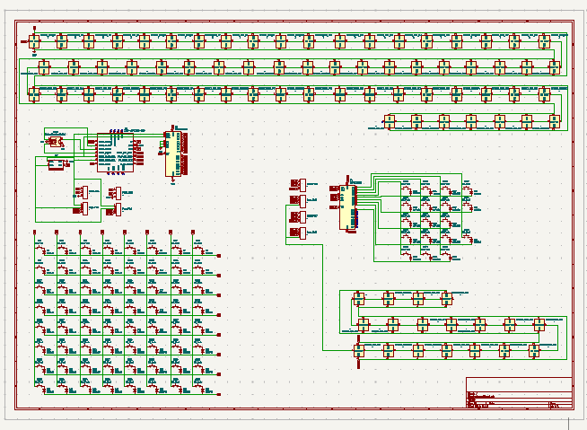

# 60% Modular Keyboard

It is a 60% wireless keyboard(bluetooth) also works wired. It has magnetic modules. Currently I only added a Numpad but almost anything could be added in a chain as long as it works on i2c.
it has hotswapable switches, rgb lights for each key, OLED, rotoary encoder, dedicated charging module(1000mah) and a 10000mah battery. Also it is kind of MCU agnostic, you can use any XIAO series MCU with it, for example rp2040 if you don't want bluetooth or nRF52840.

# CAD Design

I used shapr3d to make the case, it is not done, I am still working on it, once I am happy with a case I will add it here, but the current case is as follows:

# Wired connections

The charging module and battery are not connected to the PCB electrically, I will use wires for them.

# PCB design

I used KiCad to make the PCB. Here are the schematics:

Here is the PCB:

# Firmware

For Firmware I made two versions:

1. **QMK Firmware**: Works out of the box but it is wired only (no Bluetooth). This is ready to use.
2. **ZMK Firmware**: Supports Bluetooth wireless functionality. This will work only when ZMK is upgraded to Zephyr 3.6 or with a custom driver for the I2C expander.

Both firmware options are available in this repository under the Firmware directory.

# BOM

here's the csv: [Link](https://docs.google.com/spreadsheets/d/1DyREVeE_MUjtT9r5M6x5S8JvudkvJUOvS-f6R7vg9m8/edit?usp=sharing)
| Name | Quantity | Price (USD) | Shipping Cost (USD) |
| ------------------------- | ------------------ | ----------- | ------------------- |
| Switches | 90 | $52.85 | $0.00 |
| Keycaps | 1x set | $23.25 | $0.00 |
| Hotswapable sockets | 110 | $15.39 | $0.00 |
| Stabilizers | 1x set | $10.77 | $0.00 |
| Custom PCB | 5 | $20.00 | $25.00 |
| Magnetic pogo pins | 2x 3p and 2x 4p | $20.28 | $0.00 |
| Microcontroller | 1 | $10.27 | $5.00 |
| I2C expander | 2 | $4.68 | $9.29 |
| Battery | 1 | $6.30 | $0.00 |
| Battery protection module | 1 | $4.00 | $0.00 |
| Charging module | Will supply myself | $0.00 | $0.00 |
| Boost converter | Will supply myself | $0.00 | $0.00 |
| Rotatory Encoder | Already owned | $0.00 | $0.00 |
| OLED module | 1 | $5.00 | $0.00 |
| **Total** | | **$172.79** | **$39.29** |
| **Complete Cost** | | **$212.08** | |

> The complete cost does not include the 3D printed case.

**Important Note**: You might find some of these components cheaper on AliExpress, but trust me, their shipping costs to Pakistan are absolutely insane. I created this BOM keeping Pakistani shipping costs in mind - sometimes paying a bit more upfront is way better than getting hit with crazy shipping fees later. If you're in a different country, definitely check AliExpress for better deals, but for us Pakistanis, this is probably your best bet cost-wise.
